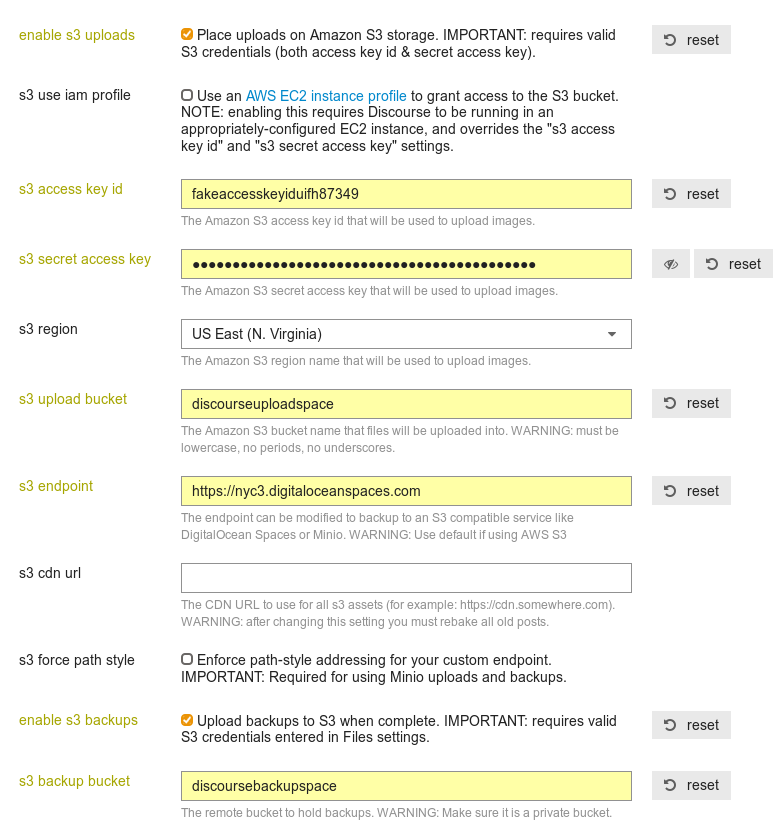

## Introducing DigitalOcean Spaces for Discourse
_S3 API compatible object storage_

* Spaces is available for a simple **$5 per month** price and includes **250GB** of storage and **1TB** of outbound bandwidth. There are no costs per request and additional storage is priced at the lowest rate available: **$0.01 per GB** transferred and **$0.02 per GB** stored. Uploads are free. Spaces provides **cost savings of up to 10x** along with predictable pricing and no surprises on your monthly bill. Read more here: [Introducing Spaces Object Storage](https://blog.digitalocean.com/introducing-spaces-object-storage/)

* If you're already running Discourse on a DigitalOcean VPS, you could move your uploads/backups to Spaces to keep everything under a single platform and billing mechanism. 
## Step 1: Configuring DigitalOcean Spaces

### Creating an Account

Go to https://www.digitalocean.com/products/spaces/ and click on Try Free for 2 months. If you already have a DigitalOcean account, log in and visit https://cloud.digitalocean.com/spaces.

### Generating API Keys

Visit https://cloud.digitalocean.com/settings/api/ and generate a new key in the Spaces Access keys section. Store this key pair safely as you will not be able to view it again. This key pair is the Access Key ID and your Secret Access Key for accessing all your Spaces (buckets) on DigitalOcean.

## Step 2: Configuring Discourse

After setting up DigitalOcean keys, the final step is to configure your Discourse instance. Make sure you're logged in with an administrator account and go the **Settings** section in the admin panel.

Type in "s3" in the textbox on the top-left to display only the relevant settings:

You will need to:

- Check the "`enable s3 backups`" checkbox if you want to activate manual or automated backups
  - Enter the desired Space name (bucket) in "`s3 backup bucket`" if `enable s3 backups` is checked
- Check the "`enable s3 uploads`" checkbox if you want to allow images to be uploaded and served by DigitalOcean Spaces
  - Enter the desired Space name (bucket) in "`s3 upload bucket`" if `enable s3 uploads` is checked
- Paste in both "`Access Key ID`" and "`Secret Access Key`" in their respective text fields
- In `s3_endpoint`, paste in one of the below endpoints to select your preferred region:
  - https://nyc3.digitaloceanspaces.com [New York]
  - https://ams3.digitaloceanspaces.com [Amsterdam]
  - https://sgp1.digitaloceanspaces.com [Singapore]

Discourse will automatically create the Spaces (buckets) required for uploads/backups.

Note: If you'd like to configure the Space yourself using the website instead of Discourse, create a Space at https://cloud.digitalocean.com/spaces and copy the endpoint from the Settings pane of your newly created Space into `s3 endpoint`.

In the case of DigitalOcean, The "`region`" setting is overridden by the region provided in the endpoint you pasted earlier, for example: https://**nyc3**.digitaloceanspaces.com

**What your settings should look like for DigitalOcean:**
_(Admin -> Settings -> Type 's3' in filter)_

**Note:** _You can enable only backups or only uploads or both._

## Enjoy

That's it. From now on, your images or backups will be uploaded to and served from DigitalOcean. 

